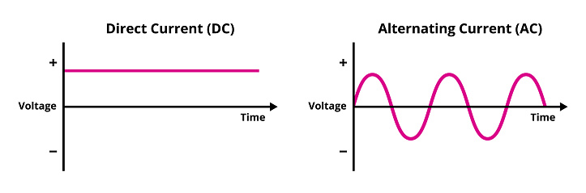
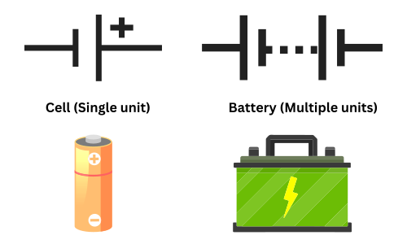
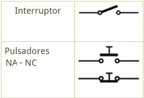

# Conceptos básicos de electricidad ⚡

La **electricidad** está presente en casi todo lo que usamos: el móvil, la tele, la nevera o la luz de casa. Es una forma de **energía** que hace funcionar los aparatos y facilita nuestra vida diaria.  

Todo esto es posible gracias a una serie de **leyes** que explican cómo se comporta la corriente eléctrica. Estas leyes relacionan tres magnitudes muy importantes:

- La **resistencia eléctrica**.
- La **diferencia de potencial** (también llamada **tensión** o **voltaje**).
- La **intensidad de corriente**.

---

## 1.1. Diferencia de potencial y corriente eléctrica ⚙️

La materia que nos rodea está formada por **átomos**, y gracias a ellos existe la **electricidad**. Aunque son muy pequeños, los átomos tienen tres partes principales:

- **Electrón (−)** → tiene carga **negativa**.  
- **Protón (+)** → tiene carga **positiva**.  
- **Neutrón (0)** → **no tiene carga**.

Son los **electrones** los responsables del flujo eléctrico, ya que pueden desplazarse de un átomo a otro cuando hay energía suficiente para empujarlos.

| Concepto | Explicación sencilla | Unidad de medida |
|-----------|----------------------|------------------|
| **Diferencia de potencial (voltaje)** | Es la energía que empuja a los electrones para que se muevan por el circuito. También se llama **tensión eléctrica**. | **Voltio (V)** |
| **Corriente eléctrica** | Es el movimiento de los electrones por un conductor. Cuantos más electrones pasan, **mayor es la corriente**. | **Amperio (A)** |

💡 **Analogía fácil:**  
Imagina dos depósitos de agua conectados por una tubería. Si uno está más alto, el agua se mueve hacia abajo por la diferencia de altura.  

En electricidad ocurre igual: la **diferencia de potencial** empuja los **electrones** a moverse, y ese movimiento es la **corriente eléctrica**.

!!! note "Recuerda"
    La **tensión (V)** impulsa a los electrones.  
    La **corriente (A)** indica cuántos electrones se mueven.  
    Y la **resistencia (Ω)** se opone al paso de la corriente.

---

### 1.1.1. El sentido de la corriente 🔁

Por **convenio**, se considera que la corriente va **del polo positivo al negativo**, aunque en realidad los **electrones** se mueven **al revés**: del **negativo al positivo**. Este acuerdo facilita que todos los esquemas eléctricos se representen de manera uniforme.

??? info "🔎 Curiosidad: la tensión eléctrica en distintos países"
    En **España**, la electricidad doméstica tiene una **tensión de 230 voltios (V)**.  
    Sin embargo, en otros países —como Estados Unidos o Japón— la tensión suele ser de entre **100 y 127 V**.  
    Esto explica por qué **no todos los aparatos eléctricos** pueden conectarse directamente a enchufes extranjeros sin un adaptador o transformador.

!!! example "Ejemplo práctico"
    Cuando enciendes una linterna, los electrones salen del **polo negativo** de la pila y viajan hacia el **positivo**, haciendo que la bombilla se encienda.

---

## 1.2. Intensidad de corriente ⚡

La **intensidad de corriente** indica la **cantidad de electrones** que pasan por un conductor en un segundo. Se mide en **amperios (A)** y nos dice **cuánta electricidad circula** por el circuito.

Según su tipo, la corriente puede ser:

- **Corriente continua (CC)** → la intensidad **no cambia** con el tiempo.  
  Ejemplo: una **pila o batería**.  
- **Corriente alterna (CA)** → la intensidad **varía constantemente**.  
  Ejemplo: la **corriente de casa**.

💡 **Cuanta mayor es la intensidad, mayor es la cantidad de electrones** que circulan por el mismo punto en un determinado tiempo.

!!! note "Recuerda"
    - La **intensidad (A)** mide la cantidad de electrones que pasan.  
    - El aparato que la mide se llama **amperímetro**.  
    - Se conecta **en serie** dentro del circuito.

??? info "🔎 Curiosidad"
    El **amperímetro** es muy parecido a un multímetro o polímetro.  
    Se utiliza para medir la corriente, y al conectarlo, **debe colocarse en serie**,  
    ya que así los electrones pasan también a través del aparato de medida.

---

## 1.3. Resistencia eléctrica 🔌

La **resistencia eléctrica** es la **oposición** que presenta un material al paso de la corriente. Se mide en **ohmios (Ω)** y el instrumento que la mide se llama **óhmetro** (o también se encuentra dentro del **multímetro**).

La resistencia depende de:

- El **material** (no todos los materiales conducen igual),
- La **longitud** del conductor (cuanto más largo, más resistencia),
- Y su **sección** o grosor (cuanto más fino, más resistencia).

En general, podemos distinguir tres tipos de materiales:

| Tipo de material | Descripción | Ejemplo |
|------------------|-------------|----------|
| **Conductor** | Permite fácilmente el paso de la corriente. | Cobre, aluminio |
| **Aislante** | No permite el paso de la corriente. | Plástico, goma |
| **Semiconductor** | A veces conduce y otras no, según la temperatura o condiciones. | Silicio, germanio |

!!! note "Recuerda"
    - La **conductividad** es la facilidad con la que pasa la corriente.  
    - La **resistividad** es lo contrario: **dificulta** el paso de la corriente.  

??? tip "💡 Ejemplo práctico"
    Si comparas un **cable de cobre** con una **regla de plástico**, verás que el primero **deja pasar la corriente** y el segundo **no**. Esto ocurre porque el cobre es **conductor** y el plástico **aislante**.

---

### 1.3.1. Conductividad y resistividad 📊

Cada material tiene una **conductividad** y una **resistividad** distintas:  

| Material | Conductividad | Resistividad |
|-----------|----------------|---------------|
| **Conductor** | Alta | Baja |
| **Semiconductor** | Media | Media |
| **Aislante** | Baja | Alta |

📈 **Interpretación:**  
- Cuanto **más alta la conductividad**, **mejor pasa la corriente**.  
- Cuanto **mayor la resistividad**, **más difícil es que circule**.

---

!!! activity "🧠 Actividad"
    Busca información en Internet sobre los siguientes materiales: **titanio, goma, cobre, germanio, aluminio, cerámica, plástico.**
    
    Clasifícalos según sean **conductores**, **aislantes** o **semiconductores**, y explica brevemente por qué los has colocado en esa categoría.

---

## 1.4. Circuito eléctrico 🔋

Un **circuito eléctrico** es un conjunto de **componentes eléctricos** conectados entre sí de una manera determinada, según la finalidad que se busque.  

La **electricidad** se gestiona y se utiliza **a través de circuitos eléctricos**. Para que un circuito funcione, debe tener **una fuente de energía** (por ejemplo, una pila o batería) que proporcione **tensión eléctrica** y permita que los electrones circulen.

Existen dos formas principales de conectar los componentes:

- **Circuito en serie:** los elementos están colocados **uno detrás de otro**.  
    - Si se rompe uno, **se interrumpe todo el circuito**.  
    - La corriente **es la misma** en todos los puntos.  

- **Circuito en paralelo:** los elementos están conectados **en ramas diferentes**.  
    - Si uno falla, los demás **siguen funcionando**.  
    - La **tensión** es la misma en todas las ramas.

!!! example "Ejemplo cotidiano"
    En las luces de un árbol de Navidad, si se apaga toda la tira cuando se funde una bombilla, significa que están **en serie**. Si solo se apaga una y las demás siguen encendidas, están **en paralelo**.

??? info "🔎 Curiosidad"
    En los laboratorios y talleres se usa una **placa de pruebas** (o *protoboard*) para construir circuitos sin necesidad de soldar. Es ideal para probar conexiones y aprender cómo funcionan las resistencias y los generadores.

---

## 1.5. Ley de Ohm ⚖️

La **Ley de Ohm** relaciona las tres magnitudes eléctricas principales:

- **Tensión (V)** → voltaje o diferencia de potencial.  
- **Intensidad (I)** → corriente eléctrica.  
- **Resistencia (R)** → oposición al paso de la corriente.

Su fórmula es muy sencilla:

> **V = I · R**

Esto significa que la **tensión** es igual a la **intensidad** multiplicada por la **resistencia**. Podemos despejar la fórmula según lo que queramos calcular:

| Queremos saber... | Fórmula | Ejemplo |
|--------------------|----------|----------|
| **Tensión (V)** | V = I · R | Si I = 2 A y R = 5 Ω → V = 10 V |
| **Intensidad (I)** | I = V / R | Si V = 12 V y R = 6 Ω → I = 2 A |
| **Resistencia (R)** | R = V / I | Si V = 9 V y I = 3 A → R = 3 Ω |

!!! note "Recuerda"
    - La unidad de **tensión** es el **voltio (V)**.  
    - La unidad de **intensidad** es el **amperio (A)**.  
    - La unidad de **resistencia** es el **ohmio (Ω)**.  

??? tip "💡 Triángulo de la Ley de Ohm"
    Puedes recordar fácilmente la fórmula con este triángulo visual:

    

      
    

    📐 **Cómo usarlo:**
    - **Tapa la letra que quieras calcular:**  
      - Si tapas **V**, verás **I × R** → *V = I · R*  
      - Si tapas **I**, verás **V ÷ R** → *I = V / R*  
      - Si tapas **R**, verás **V ÷ I** → *R = V / I*

---

!!! activity "🧠 Actividades"
    1. Calcula el valor total de la **resistencia equivalente (Rₜ)** en los siguientes casos:  
       - a) Resistencias de **6 Ω y 18 Ω** conectadas **en paralelo**.  
       - b) Resistencias de **13 Ω, 12 Ω y 40 Ω** conectadas **en serie**.  

    2. Un circuito tiene una **corriente de 2 A** y una **tensión de 12 V**.  
       ¿Cuál es su **resistencia**?

    3. Si tienes una **tensión de 10 V** y una **resistencia de 5 Ω**,  
       ¿qué **intensidad de corriente** circula por el circuito?

---

## 1.6. Corriente continua y corriente alterna 🔄

La **corriente eléctrica**, según cómo se muevan los electrones y cómo cambie su intensidad con el tiempo, puede ser de dos tipos: **continua** o **alterna**.

| Tipo de corriente | Descripción sencilla | Abreviatura | Ejemplo de uso |
|-------------------|----------------------|--------------|----------------|
| **Corriente continua (CC o DC)** | Circula **siempre en el mismo sentido** y con la misma intensidad. | DC | Pilas, baterías, dinamos |
| **Corriente alterna (CA o AC)** | **Cambia de sentido e intensidad** constantemente. | AC | Enchufes domésticos, red eléctrica |

📈 En un gráfico:
- La **corriente continua** se representa como una **línea recta**, ya que mantiene un voltaje constante.
- La **corriente alterna** se representa como una **onda**, ya que el voltaje sube y baja pasando de valores positivos a negativos.

!!! tip "💡 Diferencia visual entre corriente continua y alterna"
    

      
    

    **Traducción rápida (ayuda de vocabulario):**
    
    - **Direct Current (DC)** → *Corriente Continua*  
    - **Alternating Current (AC)** → *Corriente Alterna*  
    - **Voltage** → *Voltaje o tensión eléctrica*  
    - **Time** → *Tiempo*  
    - **+ / −** → *Polaridad positiva y negativa*

    📈 En la **corriente continua (DC)** el voltaje se mantiene **constante** en el tiempo.  
    ⚡ En la **corriente alterna (AC)** el voltaje **sube y baja** de forma periódica, cambiando de polaridad.

!!! note "Recuerda"
    En **España**, la electricidad que llega a las casas es **corriente alterna (CA)** de **230 V**. En otros países puede variar, como **115 V** en EE. UU. o Japón. Ten cuidado al conectar aparatos de otros lugares: pueden necesitar **adaptadores o transformadores** para no dañarse.

---

## 1.7. Pilas y baterías 🔋

Las **pilas** y las **baterías** son los elementos que **generan voltaje** en un circuito eléctrico. Gracias a ellas, los dispositivos pueden funcionar incluso sin estar enchufados.

La **principal diferencia** entre ambas es que:

- Una **pila no se recarga** cuando se gasta.  
- Una **batería sí es recargable**, por eso también se llama **acumulador eléctrico**.

!!! example "Ejemplo práctico"
    Una linterna con pilas normales dejará de funcionar cuando se agoten. Sin embargo, un teléfono móvil con batería puede recargarse una y otra vez.

| Tipo | Características | Ejemplo |
|------|------------------|---------|
| **Pila** | Genera corriente continua pero **no se recarga**. | Pilas AA o AAA |
| **Batería (acumulador)** | Se puede **recargar** varias veces. | Baterías de móvil o de coche |

!!! tip "Polos eléctricos"
    Tanto las pilas como las baterías tienen dos extremos:  
    - **Polo positivo (+)** → por donde **salen los electrones**.  
    - **Polo negativo (−)** → por donde **entran los electrones**.

  

**Traducción rápida (ayuda de vocabulario):**

- **Cell** → *Pila (una sola unidad que produce electricidad)*  
- **Battery** → *Batería o acumulador (varias celdas unidas, recargable)*

📘 En inglés, el término **"battery"** se usa a veces para referirse a **cualquier fuente eléctrica pequeña**, aunque en español se diferencia entre **pila (no recargable)** y **batería (recargable)**.

!!! info "🔋 Pilas recargables"
    Aunque también se venden **pilas recargables**, en realidad funcionan como **pequeñas baterías**. Son más **económicas y sostenibles**, ya que reducen los residuos.

!!! activity "🧠 Actividad"
    1. ¿Por qué crees que es **mejor usar baterías recargables** que pilas normales?  
    2. Busca tres aparatos que funcionen con **pilas** y tres con **baterías recargables**.  
    3. Explica cuál crees que es **más ecológico** y por qué.

## 1.8. Interruptores y pulsadores 🔘

Un **interruptor eléctrico** es un dispositivo que se utiliza para **desviar o interrumpir el paso de la corriente eléctrica**. Su función es muy sencilla: **abrir o cerrar un circuito** para controlar si la corriente pasa o no.

Sus aplicaciones van desde encender una **bombilla**, hasta controlar **máquinas o aparatos electrónicos** más complejos.

Un **botón o pulsador** es un tipo especial de interruptor que se utiliza para **activar una función temporal**, como por ejemplo el botón de encendido de un ordenador o el timbre de una casa.

| Tipo de pulsador | Abreviatura | Descripción |
|------------------|--------------|--------------|
| **Acción momentánea** | AM | Solo actúa mientras se mantiene pulsado. Ejemplo: timbre. |
| **Acción de enclavamiento** | AE | Cambia de posición cuando se oprime y se mantiene así hasta volver a pulsarlo. Ejemplo: interruptor de lámpara. |
| **Acción alternada** | AA | Cambia de estado al pulsarlo, pero no varía su posición. Se usa en mandos o selectores. |

  

<em>Símbolos eléctricos normalizados de interruptores y pulsadores (NA: normalmente abierto, NC: normalmente cerrado).</em>

!!! note "Representación gráfica"
    En los **esquemas eléctricos** se usan símbolos para representar los interruptores y pulsadores:
    
    - 🔲 **Interruptor:** abre o cierra el circuito.  
    - 🔘 **Pulsador:** permite el paso de la corriente solo mientras se mantiene presionado.

!!! tip "💡 Ejemplo cotidiano"
    
    - Interruptor: el que enciende la luz de una habitación.  
    - Pulsador: el del timbre o el botón de encendido del ordenador.

---

## 1.9. Fuentes de alimentación 🔋⚡

Una **fuente de alimentación** es un circuito que **convierte la tensión alterna (CA)** de la red eléctrica en **tensión continua (CC)**, para que los aparatos electrónicos puedan funcionar.

Por eso, **no debe confundirse con un transformador**, ya que además de cambiar el tipo de corriente, **regula y estabiliza el voltaje** de salida.

Cada fuente de alimentación incluye una **etiqueta con información importante**, que indica sus características técnicas:

| Parámetro | Significado | Ejemplo |
|------------|--------------|----------|
| **Tensión de entrada (AC INPUT)** | Indica los valores de voltaje que puede recibir de la red eléctrica. | 100–240 V (universal) |
| **Tensión de salida (DC OUTPUT)** | Muestra los voltajes de salida que puede entregar. | +12 V, +5 V, +3.3 V |
| **Capacidad de carga (MAX CURRENT)** | Máxima intensidad que puede suministrar sin dañarse. | 30 A |
| **Potencia máxima combinada (MAX WATTAGE)** | Indica la potencia total que puede entregar. | 450 W |

  

<em>Fuente de alimentación de ordenador con etiqueta técnica: se observan valores de entrada (AC), salida (DC) y potencia total.</em>

!!! info "📘 Ejemplo real"
    En la etiqueta de una fuente típica de PC se pueden ver varios datos:
    
    - **Entrada:** 100–240 V (CA) → compatible con distintos países.  
    - **Salida:** +12 V, +5 V, +3.3 V (CC).  
    - **Potencia máxima:** 450 W → indica la energía total que puede suministrar.

!!! note "Recuerda"
    Una fuente de alimentación **convierte, regula y protege**. Sin ella, los componentes electrónicos podrían **quemarse** o **no funcionar correctamente**.

!!! activity "🧠 Actividad"
    1. Busca qué significa el término **“fuente de alimentación modular”**.  
    2. Investiga cuánta potencia necesita aproximadamente una **fuente de alimentación de ordenador**.  
    3. Explica por qué es importante elegir una fuente **adecuada a la potencia** de los componentes.
